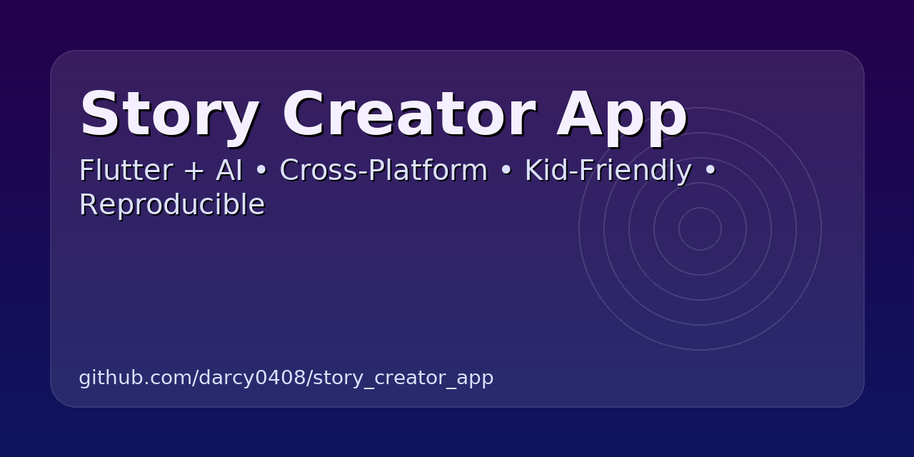

  

Story Creator App

AI-Powered, Cross-Platform Storytelling

The Story Creator App is a Flutter + AI project that generates personalized, therapeutic adventures for children.
It combines creative story generation with cross-platform support, making it available on mobile, web, and desktop.

✨ Features

🎭 Personalized Storytelling — AI adapts adventures to the child’s name, interests, and themes.

🧠 Therapeutic Design — Helps kids explore emotions and problem-solving through guided narratives.

📱 Cross-Platform Support — Runs on Android, iOS, web, Linux, macOS, and Windows via Flutter.

⚡ Lightweight & Reproducible — Uses low-compute AI models to ensure accessibility across devices.

🔐 Bias-Mitigation Tools — Incorporates fairness techniques for responsible AI story generation.

🛠 Tech Stack

Frontend: Flutter (Dart) for UI and cross-platform deployment.

Backend / AI Engine: Python (AI logic, text generation).

Native Components: C++ modules (performance-critical story functions).

Other Tools: CMake, Swift (iOS integration), GitHub Actions for CI/CD.

🚀 Getting Started
### Prerequisites
- [Flutter SDK](https://docs.flutter.dev/get-started/install)  
- [Python 3.10+](https://www.python.org/downloads/)  
- [Git](https://git-scm.com/downloads)  

Installation
# Clone the repo
git clone https://github.com/darcy0408/story_creator_app.git
cd story_creator_app

# Install Flutter dependencies
flutter pub get

# Run on a connected device or emulator
flutter run

📂 Project Structure
story_creator_app/
├── android/      # Android platform code
├── ios/          # iOS platform code
├── linux/        # Linux desktop support
├── macos/        # macOS desktop support
├── web/          # Web version
├── windows/      # Windows desktop support
├── backend/      # Python-based AI engine
├── lib/          # Flutter/Dart app code
├── test/         # Unit + widget tests
└── README.md

📸 Screenshots (Coming Soon)

Add UI previews or demo GIFs here once available.

# (Optional) Set up backend
cd backend
pip install -r requirements.txt
python run.py

🧭 Roadmap

 Add interactive choice-based story branching

 Integrate voice narration

 Export stories to PDF/eBook

 Add parental control dashboard

🤝 Contributing

Contributions, feedback, and new story modules are welcome!

Fork the project

Create your feature branch (git checkout -b feature/AmazingFeature)

Commit your changes (git commit -m 'Add some AmazingFeature')

Push to the branch (git push origin feature/AmazingFeature)

Open a Pull Request

📜 License

This project is licensed under the MIT License — see the LICENSE file for details.
